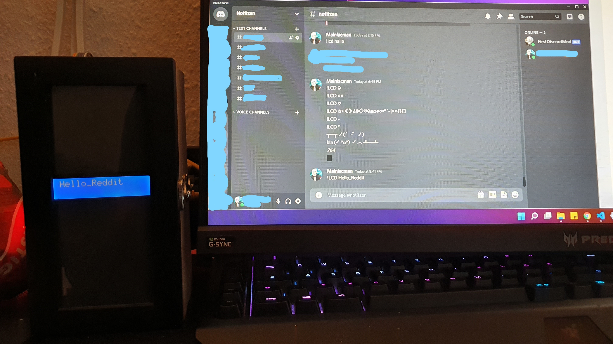

- [IDE & Platform](#ide-and-platform)
- [Idea](#idea)
- [Commands](#commands)
- [Hardware](#hardware)
- [Images](#images)

# Discord Bots

### IDE and Platform
- VS Code
- Maven
- Need external "token.json" => {"token": "dashieristderdiscordbottoken"}

### Idea
Discord provides a web socket here, I play with it for my own little server.

### Commands

### !tick
- makes a tic tac tow play field
- interact with the game with Discord "reactions"

### !4
- makes a 4wins play field
- interact with the game with the "reactions"

### !essen
- returns a random recipe from the food channel when you can't decide what to cook today

### !help
- gets list with all commands

### !lcd 
- example message "!lcd thisisatest"
- prints the message on microcontroller lcd display
- no spaces allows
- max 2x16 characters

### Hardware
- PI3
- LCD => qapass 1602a

### Images

